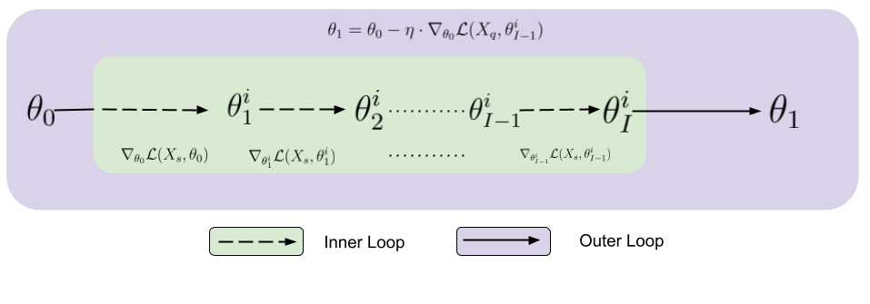

# FaAlGrad: Fairness through Alignment of Gradients across Different Subpopulations

This repository contains the implementation of the Fairness-Aware Algorithm for Gradient Alignment (FaAlGrad), accepted at Transactions on Machine Learning Research (TMLR). This work explores fairness in machine learning through meta-learning techniques.

## Overview of the Paper

This work aims to handle the bias in machine learning models and enhance their fairness by aligning the loss gradients. Specifically, leveraging the meta-learning technique, we propose a novel training framework that aligns the gradients computed across different subpopulations for learning fair classifiers. Our experiments on multiple benchmark datasets demonstrate significant improvements in fairness metrics without having any exclusive regularizers for fairness. 

Below is a visual representation of the proposed framework:


## Requirements

- Python 3.9 or lower (not compatible with Python 3.11+ due to library restrictions).
- Ensure `pip` and `conda` are installed on your system.

Install necessary libraries by running:
```bash
pip install -r requirements.txt


